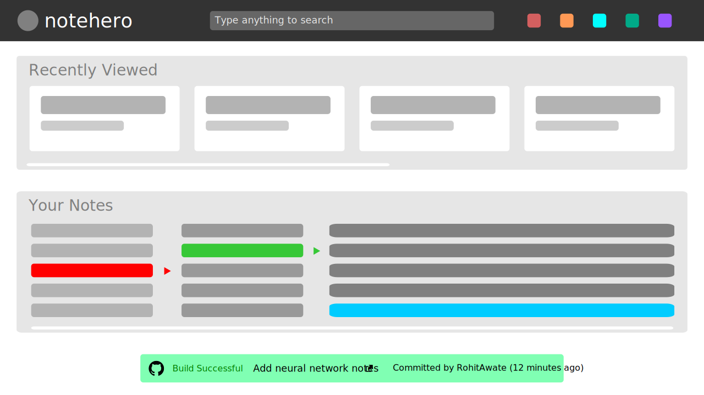
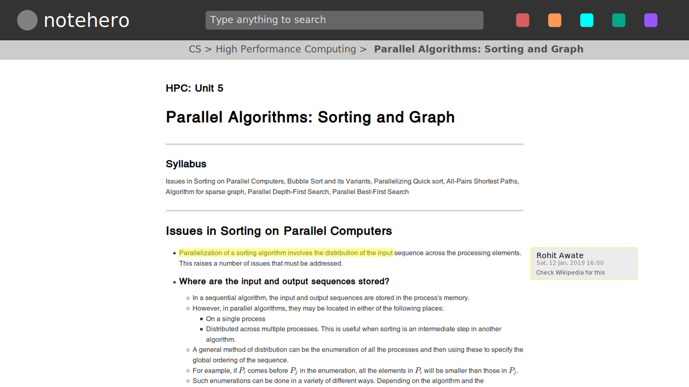
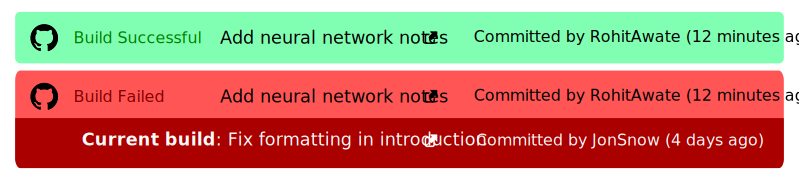

# NoteHero: Design Specification

## Architecture

1. Users push their code to their Git service of choice.
2. The service invokes a webhook to the NodeHero server with the information about the push.
3. NoteHero checks the webhook payload if new commits are present. If no, it skips further steps.
4. If new commits are found, NoteHero pulls the latest changes from the Git service.
5. NoteHero renders the modified/new notes to HTML and builds the search index.
6. On an HTTP request, the fully rendered page is returned in the response. NoteHero also establishes a WebSocket connection with the browser. This is used to push update notifications in case a new commit is pushed whilst NoteHero is already running in the browser.

## Server Endpoints
####  `POST /rebuild`
- This is the endpoint invoked by the webhook registered on the Git service. It is invoked when there is a new push.
- Only accepts requests from the Git service.
- Requires a mutex lock to prevent data races while rendering HTML and building the search index.
- Should only re-render HTML and rebuild search index for modified/new notes.
- Re-organizes the comments based on the changes in the file.

#### `GET /cat1/cat2/.../catn/note-slug`
- Delivers the note nested in these categories.
- If the note has `sudo` enabled in the YAML front matter _(check specification below)_, the session cookie is checked. If not authorized, HTTP 401 (Unauthorized) status code is returned with a webpage with an option to sign in.
- The slug should either be specified in the YAML frontmatter of the Markdown source or be generated from the filename. For the latter option, skip the file extension.
- Check mockup below.  

#### `GET /comments?note=/cat1/cat2/.../catn/note-slug`
- **<span style="color:red">Future scope.</span>**
- API endpoint, returns JSON array of comments for that note.
- If the note has `sudo` enabled in the YAML front matter, the session cookie is checked. If not authorized, HTTP 401 (Unauthorized) status code is returned.
- Each line in the note can have multiple comments.
- Sample response:
```json
[
    {
        "rangeStart": 10,
        "rangeEnd": 15, 
        "index": 1,
        "timestamp": "2019-01-19 03:14:07",
        "body": "Check Wikipedia for this"
    },
    {
        "rangeStart": 10,
        "rangeEnd": 15,
        "index": 2,
        "timestamp": "2018-05-06 05:45:12",
        "body": "Add citation"
    }
]
```
- [`rangeStart`, `rangeEnd`]: inclusive limits of the range of data over which the comment is applied
- `index`: the index of the comment among the list of all comments for that line
- `timestamp`: the time instance when the comment was made
- `body`: the actual textual content of the comment 

#### `POST /comments`
- **<span style="color:red">Future scope.</span>**
- API endpoint, accepts a JSON object containing the note's slug and the comments to be added.
- Sample payload:
```json
{
    "note": "/cat1/cat2/.../catn/note-slug",
    "comments": [
        {
            "rangeStart": 10,
            "rangeEnd": 15, 
            "timestamp": "2019-01-19 03:14:07",
            "body": "Check Wikipedia for this"
        },
        {
            "rangeStart": 10,
            "rangeEnd": 15,
            "timestamp": "2018-05-06 05:45:12",
            "body": "Add citation"
        }
    ]
}
```
- `note`: specifies which note the comments belong to
- Note the lack of an `index` field. It is added by the server/database after checking if there are other comments for this range.

#### `POST /login`
- Allows user to login.
- Accepts `application/x-www-formurlencoded` payload.
- Expected fields:
    - `username`: username in plaintext
    - `password`: hashed password _(refer: https://stackoverflow.com/a/48161723)_
    - `csrf_token`: CSRF token injected by server into webpage
- Response places session cookie in the browser.

#### `GET /logout`
- Clears the session on the server and its corresponding cookie in the browser.

#### `GET /`
- Delivers the homepage.
- Check mockup below.

## Mockups

#### Homepage


#### Notes View


#### Git Build Banners


## Front Matter Specification
```yaml
---
notehero:
    title: 'Convolutional Neural Networks'
    sudo: false
    slug: 'cnn'
    categories: 'CS > Deep Learning'
---
```

NoteHero's rendering and search indexing can be configured by adding the above block of YAML Front Matter at the beginning of your note.

- `title` (String, _required_): Applied to the `<title>` tag in the rendered HTML.
- `sudo` (Boolean, _optional_): Defines the visibility of the note. If `true`, note is only visible when logged in, else it is publicly visible. **Defaults to `true`**.
- `slug` (String, _optional_): Used in the URL of the final note. The format of the URL is as follows: `/cat1/cat2/.../catn/slug` where `cat1`, `cat2`, etc. are the `categories` in the YAML Front Matter.
\
**Default behaviour is as follows:**
    - **For camel-case filenames**:
    Extension is omitted. The individual words from are separated, converted to lower-cased and then concatenated by adding hyphens in the middle.
    For example, `HelloWorld.md` becomes `hello-world`.
    - **For snake-case filenames**:
    Extension is omitted. Underscores are replaced with hyphens.
    For example, `hello_world.md` becomes `hello-world`.
    - **For filenames with spaces**:
    Extension is omitted. Spaces are replaced with hyphens. Entire string is converted to lowercase.
    For example, `Hello world.md` becomes `hello-world`.
- `categories` (String, _optional_): Categories should separated by > i.e. closing angle bracket and written left to right in decreasing order of hierarchy. For example, refer the above example. Categories are included in the search index and used to organize the notes in a hierarchy, as shown in the homepage mockup. \
**Defaults to no categories and thus uses the URL `/slug`, if not already claimed. If claimed, a build error results.**

Attributes marked as _required_, if not provided in the YAML Front Matter, will result in a build error.

## Implementation Guidelines
_Work in progress_

## Keybindings

| Action | Keybinding |
| - | - |
| Ctrl + Shift + M | Add comment on line |
| Ctrl + Shift + F | Focus fuzzy search box |

_Work in progress_
