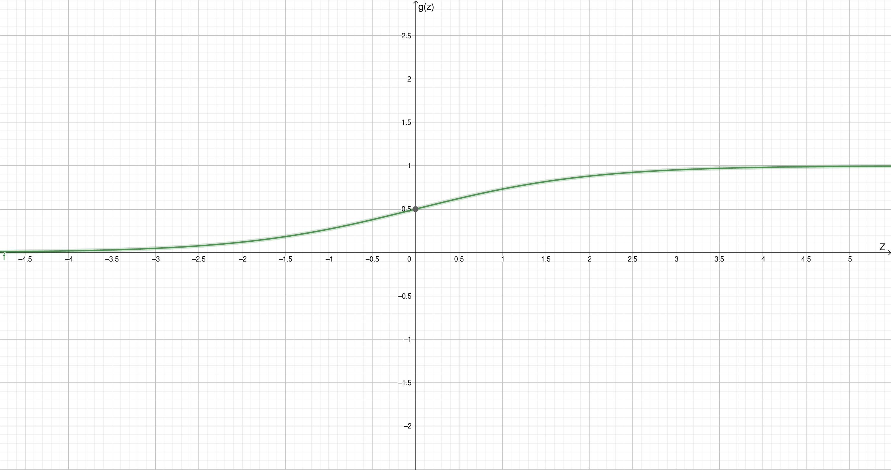

---
puppeteer:
    format: A4
    scale: 0.8
notehero:
    title: 'Logistic Regression'
    sudo: false
    tags: machine learning, stanford, coursera, logistic regression, andrew ng
---

### Stanford Machine Learning
# Logistic Regression

---

## Classification

Unlike regression's continuous outputs, classification produces discrete ones. For example, 0 or 1, true or false, yes or no. This can be used in a variety of tasks such as determining if an email is spam or not, a tumor is malignant or not, etc.

---

## Linear Regression for Classification
- We can use linear regression to generate a line which may separate the points into two distinct correct groups.
- We can set a threshold for the output and thereby use the line as a classifier.
- However, this model does not work well in case of outliers, as the line will be influenced by it.
- Linear regression can work well for classification problems purely based on luck, and not otherwise. Thus, it is not a good idea to use it for classification.
- Additionally, linear regression can output values $<0$ and $>1$. For classification, we need $ 0 \le h_\theta(x) \le 1 $.

---

## Logistic Regression Model
- For classification, we need the output to be between 0 and 1 i.e. $ 0 \le h_\theta(x) \le 1 $. Thus, we need to squish the continuous line between this interval.
- One way to do this is using a logistic/sigmoid function.

```math

h_\theta(x) = g(\theta^Tx) \\
g(z) = \frac{1}{1 + e^{-z}}

```



- The logistic function **restricts the output between 0 and 1 at the origin**. This solves the issue of range of values.
- This is the representation of our hypothesis.

#### Classification Threshold
Now, we can set a threshold between 0 and 1 for classification. For example, we can decide that if $ h_\theta(x) \ge 0.5 $, then $ y = 1$.
Thus, 
```math
h_\theta(x) = g(\theta^Tx) \\
\therefore g(\theta^Tx) \ge 0.5
```

The curve rises above 0.5 when $ Z \ge 0 $ i.e. when $ \theta^Tx \ge 0 \because Z = \theta^Tx. $ \
$$ \therefore y = 1 \mid \theta^Tx \ge 0 $$
